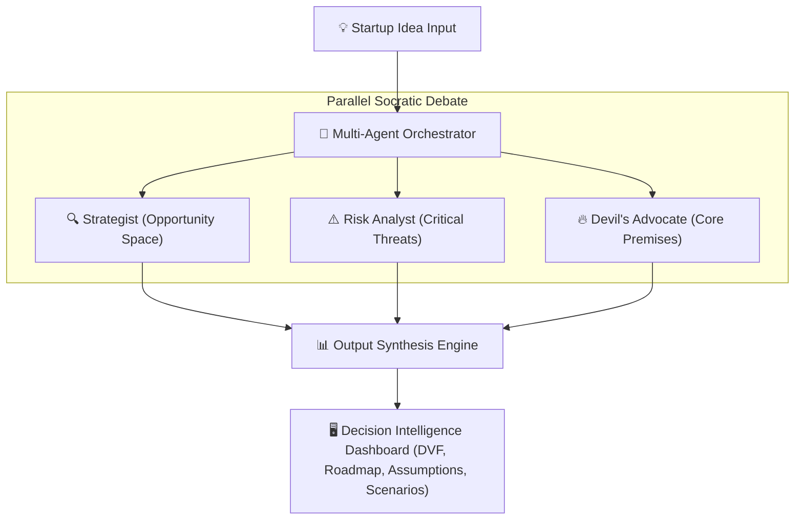

# FirstMove — Multi-Agent Decision Intelligence 🎯

[](LICENSE)
[](CODE_OF_CONDUCT.md)
[](https://firstmove-five.vercel.app)
[](https://react.dev)
[](https://vitejs.dev)

> **Get three independent AI perspectives on your startup idea before you build the wrong thing.**

FirstMove harnesses multi-agent debate to surface critical assumptions and unknowns in your business idea. Instead of a single opinion, three specialized AI agents evaluate your concept in parallel, exposing blind spots and highlighting what you should validate first.

🌐 **Live Demo:** [firstmove-five.vercel.app](https://firstmove-five.vercel.app)

---

## 🚀 Key Features

*   **⚡ Parallel Multi-Agent Debate**: Three AI agents debate your business idea simultaneously in a Socratic forum.
*   **📊 DVF (Desirability, Viability, Feasibility) Analysis**: Quantitative scoring on each core dimension to assess structural health.
*   **🤝 Ethical, Human-in-the-Loop AI**: AI agents expose uncertainty and outline trade-offs without making the final "go/no-go" decision.
*   **🗺️ De-risked Action Roadmap**: Translates debate outcomes into a sequenced testing roadmap arranged by risk weight.
*   **🔮 Scenario Modeling**: Generates best-case, average-case, and worst-case scenarios based on current assumptions.

---

## 🛠️ How It Works

FirstMove coordinates a Socratic debate using three specialized LLM agents, then synthesizes their evaluations into an interactive workspace:



### The Debating Agents:
1.  **The Strategist** 🔍: Focuses on size of opportunity, product-market fit, and positive market forces.
2.  **The Risk Analyst** ⚠️: Surfacess regulatory, execution, technical, and capital risks.
3.  **The Devil's Advocate** 🔥: Directly challenges your core premise, highlighting structural industry barriers and substitute products.

---

## 📁 Repository Structure

```text
firstmove/
├── public/                # Static assets (compressed background videos, icons)
├── src/
│   ├── components/        # Reusable UI components (Navbar, Loader, etc.)
│   ├── screens/           # Main screen flows
│   │   ├── LandingPage.jsx        # Premium scrolling marketing landing page
│   │   ├── Screen1_Idea.jsx       # Startup idea intake screen
│   │   ├── Screen2_Questions.jsx  # Context-gathering questionnaire
│   │   └── Screen3_Workspace.jsx  # Interactive synthesized debate dashboard
│   ├── App.jsx            # Application viewport boundaries and screen state
│   ├── index.css          # Tailwind directives, animations & custom styles
│   └── main.jsx           # App entry point
├── LICENSE                # Apache 2.0 License file
├── CODE_OF_CONDUCT.md     # Contributor Code of Conduct rules
├── CONTRIBUTING.md        # Guidelines for joining the project
├── SECURITY.md            # Security vulnerability reporting instructions
├── vite.config.js         # Build configuration
└── package.json           # Project dependencies
```

---

## 💻 Local Setup & Installation

Follow these steps to run the client application locally.

### Prerequisites
- **Node.js** (v18 or higher recommended)
- **npm** or **yarn**

### Installation
1.  Clone the repository:
    ```bash
    git clone https://github.com/akshayjadhav237237-cmd/FirstMove.git
    cd FirstMove
    ```
2.  Install dependencies:
    ```bash
    npm install
    ```
3.  Launch the development server:
    ```bash
    npm run dev
    ```
4.  Open `http://localhost:5173` in your browser.

---

## 🚀 Deployment

The project is configured for deployment to **Vercel** with zero-configuration:

```bash
# Install Vercel CLI globally
npm install -g vercel

# Deploy to production
vercel --prod
```

---

## 🤝 Contributing

We welcome contributions to FirstMove! Please check out our [Contributing Guidelines](CONTRIBUTING.md) to get started.

## 📄 License

FirstMove is distributed under the terms of the **Apache License 2.0**. See the [LICENSE](LICENSE) file for details.
